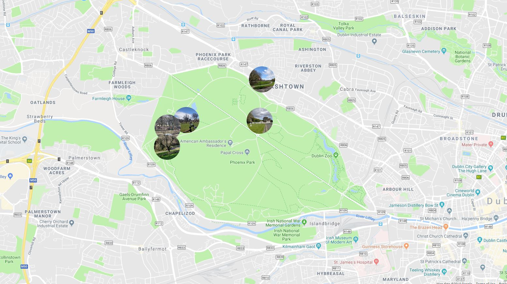

# UnnamedPictureMapsThing

This program extracts the GPS metadat from your photos and plots them as circular icons on Google maps.

## Install
Pre-reqs:
i. python 3
ii. pip installed

1. Clone repo
2. "pip install -r requirements.txt
3. Fill in your google maps API if you have one

## How to use
1. Put your pics that you want to plot into a folder somewhere.
2. Run 'py(thon) main.py <folder path>'
  
For the example given here - inside the src directory - this would be "py main.py ../examples-trips/phoenixpark/"

3. Open the new map html file and you should see your pictures plotted where they were taken.

## To Do
1. Make sure it works for all smartphones
2. Add functionality for DSLRs
3. Map should centre on the first pic, or zoom to fit all pics.
